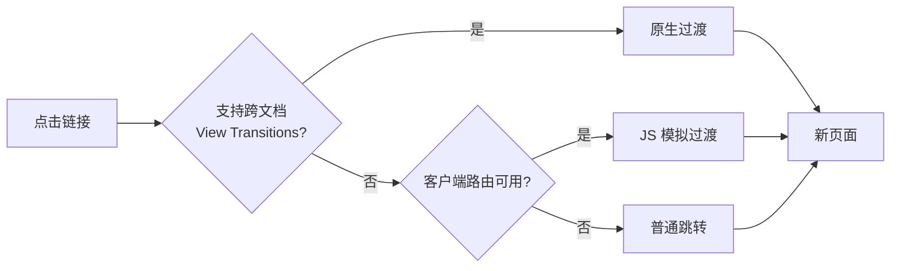

页面之间跳转时那一下白闪，是静态站给人「廉价」感的最大来源。View Transitions API 就是用来解决它的，但它的支持情况比大多数教程写的要复杂。

## 支持现状

到 2026 年，跨文档 View Transitions 在 Chromium 系和 Safari 18.2+ 上原生可用。Firefox 的同文档过渡从 144 起进入稳定版，**跨文档仍未完成**。MDN 上 `@view-transition` 标注的是 "Limited availability"，明确不是 Baseline。

结论很直接：**它只能当渐进增强用**。

## 三种做法的取舍

| 做法 | 覆盖率 | 代价 |
| --- | --- | --- |
| 纯 CSS `@view-transition` | 只有原生支持的浏览器 | 零 JS |
| 客户端路由补齐 | 全部现代浏览器 | 一点 JS |
| 不做 | 全部 | 白闪 |

这个站选的是第二种：原生支持的浏览器走原生，其余交给客户端路由，再不济退化成普通跳转——**不报错，也不闪白**。

## 代码

```css
@view-transition {
  navigation: auto;
}

::view-transition-old(root) {
  animation: fade-out var(--motion-base) var(--ease-out) both;
}
```

注意所有时长都走 CSS 变量。这样降级开关只要改一处：

```css
@media (prefers-reduced-motion: reduce) {
  :root {
    --motion-base: 0ms;
  }
}
```

## 别忘了这一条

过渡动画的感知时长和实际时长不是一回事。设 $t$ 为动画时长，用户感知的等待成本大致随 $t$ 超线性增长：

$$
C(t) \approx \alpha t + \beta t^{2}
$$

所以宁可短，不要长。240ms 是个安全值，超过 400ms 就开始碍事了。

## 整体流程


